## Microservices 

By Sachin Dixit

## Overview

- Services   
- Web Services   
- Interface   
- API   
 Conways Law  
- SOA   
- Services bus ESB  
- Events hub  
- EIP (list them)   
  
What is the definition of above ? and what is the difference ?

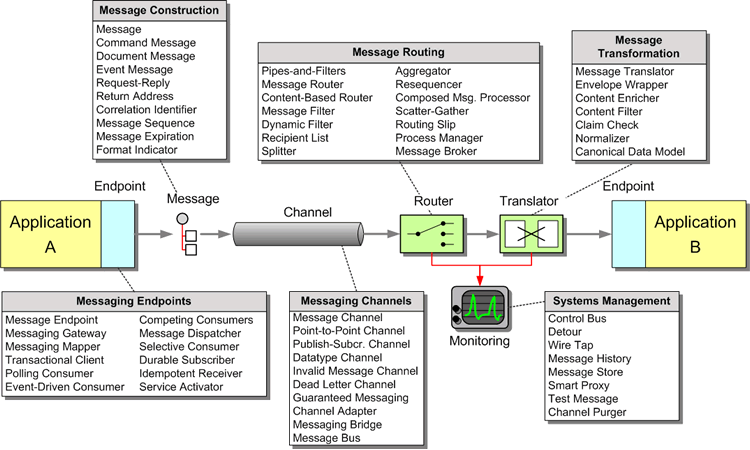

## 2-Tier Architecture

- Client Tier  
  - The user interface and application programs are run on client side  
- Data Tier  
  - Database server  
  
- Advantages   
  - Fast and easy to implement  
  - Communication Faster  
  - Suitable where business rules/logic/operations are static   
- Disadvantages  
  - Performance degrade with scale   
  - Data integrity due to race conditions  

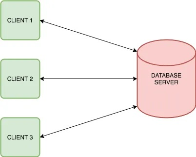

A tier (not to be confused with layer) refers to the physical separation of an application. On the other hand, a layer refers to the logical separation of an application. 
## 3-Tier Architecture

- Presentation tier  
  - Represents the clients.  
  - HTML,CSS,JavaScript (React/Angular/Vue)  
- Business/Application tier   
  - Acts as an intermediary for partially processed data , hold application logic.  
  - Spring , .Net , Javascript with NodeJs    
- Data tier   
  - Database server.  
  - MySQL , MongoDB, SQLite,PostgreSQL  

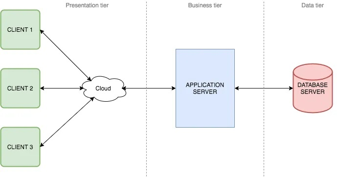

## 3-Tier Architecture Continued..

- Advantages  
  - Scalability – Each tier can scale horizontally  
  - High degree of flexibility in deployment   
  - Better performance – caching at presentation tier  
  - Improved data integrity  
  - Improved security  
  - Make use of distributed computing  
  
- Disadvantages  
  - Increased complexity of implementation  
  - Increased Teams and Efforts   
  - Complicate Observability

## 3-Tier Architectures : Monolith Vs Microservices

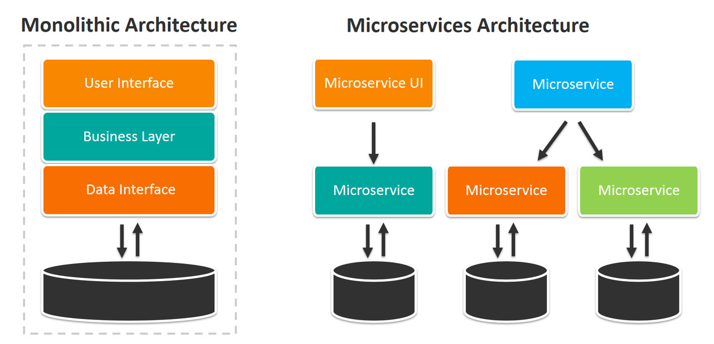

## Today's Web Architechture

## Web Application Architechture Components

## N tier Era

- Logical Layers  
- Physical Tiers  
- Clustered Scalability   
- VM compatible   
- Mostly Fast but entangled  
- PM syndrome !   
  
Credit : https://docs.microsoft.com/en-us/azure/architecture/guide/architecture-styles/n-tier

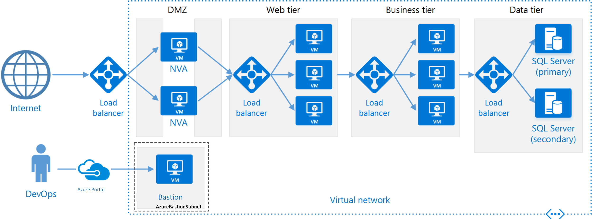

## Monolith 

- Single unit deployment , Scale by clustering ( NDs of WAS)   
- Might have single code base   
- All calls native !  
- Code might be entangled  
- Single DB/Schema ,often SPs  
- Suspected bad guy of MSA   

## Evolution of Dynamic Content under Web Architechture 

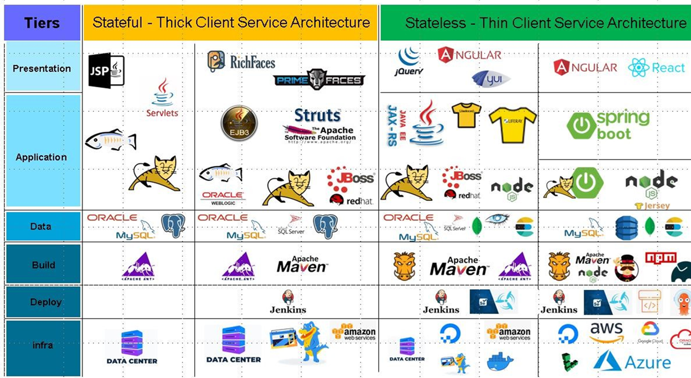

## Good Design : Good team

- Modularity   
- DDD  
- High cohesion - Loose coupling   
- Team insulation   
- Co-location   

## Evolution Of Microservice Architecture  

- Monolith :   
  - Simple, easy to develop but difficult to scale and maintain.  
- SOA :  
  - Partial service separation, but still complex with ESB reliance.  
- Microservices   
  - Fine-grained, independent services with better scalability, flexibility, and faster deployments.  
- Serverless and Edge Computing  
  - Further decentralization and simplification, reducing infrastructure concerns and improving responsiveness.  
   
- Key Influencers:  
  - Agile and DevOps   
  - Cloud computing  
  - Container and Orchestration (Docker/Kubernetes)  

## Other Drivers 

- Virtualization (of the hw stack )  
- Containers   
- Elastic compute (server disposability  )  
- Stronger Open source  
- Developer preferences  
- Better networks  
- Agile culture   
- Innovation speeds !    
- NoSQL   
- Dependency repos 

## Microservices 

A microservices architecture consists of a collection of small, autonomous services. Each service is self-contained and should implement a single business capability.  
- Small, independent, loosely coupled  
- Each service is a separate codebase, managed by a small dev team  
- Can be deployed/build/redeployed independently   
- Persist  their own data or external state   
- Communicate with each other by using well-defined APIs   
- Don't need to share the same technology stack, libraries, or frameworks  
Ref:https://docs.microsoft.com/en-us/azure/architecture/guide/architecture-styles/microservices

## Typical Microservices Deployment 

 

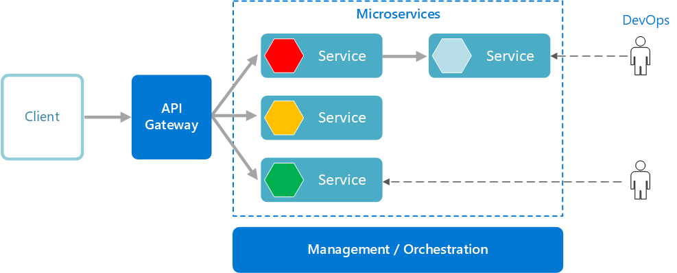

## Microservices necessitate 

- Orchestrator   
- Containers are implied but not necessary  
- Http is implied but no consensus (eg. grpc )  
- API Gateway   
  - Common Facade   
  - Multiple Protocol   
  - Factiliates Pooling / Load balancing   
  - Enforce Auth   
  - Logging   
  - Tracing   
  - Redirection   
- Sateless - not necessary   
- CI-CD are also helpful  
- Service Mes(s)h :)  

## Microservices Costs 

- More moving parts = Complexity   
- Testing evolving dependencies  
- Governance burden   
- Network trips !  
- Distributed tracing  
- Dev Skills   
- Hidden Async and BASE !  
- How small is micro enough ?

## Key Characteristics of Microservice Architecture

- Single Responsibility  
  - Each microservice is responsible for one piece of functionality or business capability  
- Decentralized Data Management  
  - Each service typically manages its own database or data storage  
- Autonomy   
  - Microservices are developed, deployed, and scaled independently  
- Inter-Service Communications  
  - Using lightweight protocols like HTTP/REST, gRPC, or messaging systems like Kafka or RabbitMQ  
- Technological Diversity  
  - Each microservice can be developed using different programming languages, databases, or tools based on the service's requirements.  
  
  

## Microservices Architecture Design Principles

- Independent and Autonomous/Self-governing services  
  - Each service can be developed, tested, as well as deployed independently without affecting the other part of the system  
  
- API aggregation   
  - Microservices  should be able communicate without having a programming language barrier  
  
- Flexibility  
  - Allow services to become adoptable to future changes  
  
- Scalability  
  - enables application to get modified according to the increasing or decreasing traffic, data, and complexity without affecting the performance of the system  
  
- Constant monitoring  
  - Logging and metrics , Health checks ,Alerting and notifications  
  

## Microservices Architecture Design Principles - Continued

- Failure Isolation/ Failure resilience  
  - Timeouts , Circuit Breakers , Throttling  
  
- Realtime Load balancing  
  - Autoscaling  
  
- Inclusion of DevOps  
  - Docker , Kubernetes  
  
- Versioning  
  - Helps to manage changes in the services over time and update them to the latest ones.   
  
- Availability  
  

## Multigrained Architecture : Think Big , Start Small , Move Fast

It is completely acceptable to have enterprise application contains microservices, miniservices and even macroservices (monolith components)  

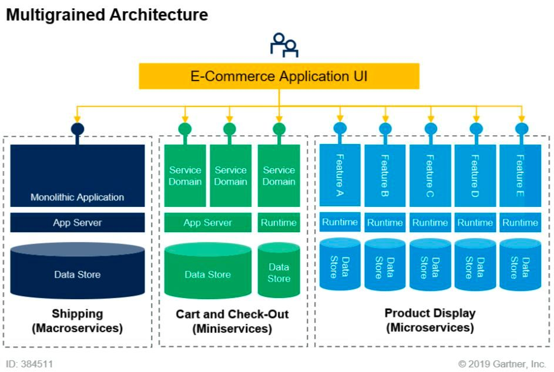

## Cloud Native & 12 Factor & Reactive  

- Parallel drivers  that implied MSA  
- Cloud Native ⇒ Loosely defined term for cloud hosted applications ,Might mean containerized , orchestrated ,microservices .   
- Pass,Iass,Fass Blah Blah  
  
https://www.cncf.io/   
 

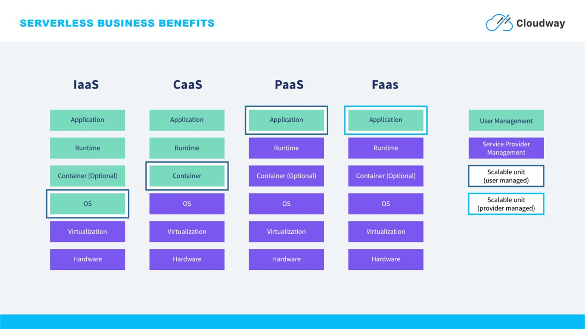

## Reactive Manifesto   

- Responsive ⇒ rapid ,consistent,time bound  
- Resilient ⇒  replication, containment, isolation and delegation  
- Elastic : predictive as well as reactive scaling   
- Message Driven :Async,Loose coupling,location transparency ,back pressure ,non blocking   
    
 

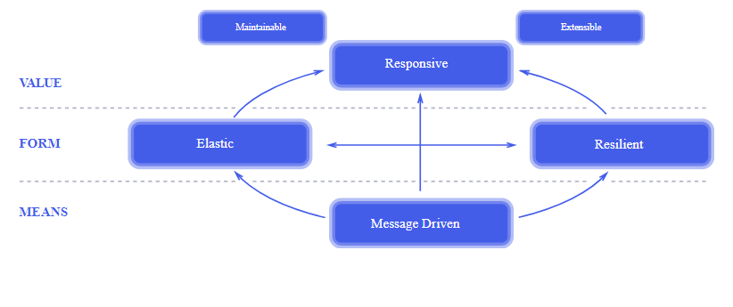

https://www.reactivemanifesto.org/   

## The Twelve Factors 

I. Codebase: One codebase tracked in revision control, many deploys  
II. Dependencies: Explicitly declare and isolate dependencies  
III. Config : Store config in the environment  
IV. Backing services : Treat backing services as attached resources  
V. Build, release, run : Strictly separate build and run stages  
VI. Processes: Execute the app as one or more stateless processes  

VII. Port binding : Export services via port binding  
VIII. Concurrency : Scale out via the process model  
IX. Disposability : Maximize robustness with fast startup and graceful shutdown  
X. Dev/prod parity : Keep development, staging, and production as similar as possible  
XI. Logs : Treat logs as event streams  
XII. Admin processes : Run admin/management tasks as one-off processes  
_XIII.API First : Make everything service   
XIV. Telemetry  : Visibility   
XII. Auth : Identity /RBAC  _
  
https://12factor.net/ 
https://github.com/cjudd/15-factor-app-workshop   

## Cloud Journey

Credit :https://cloudificationzone.com/ 

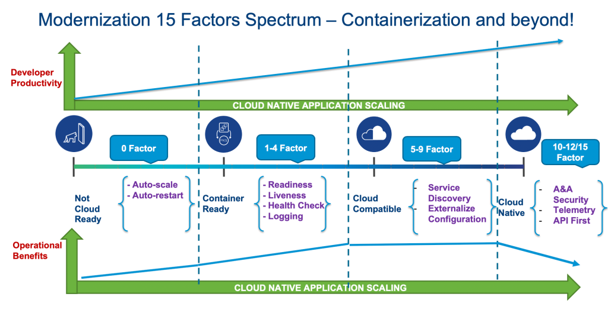

## Approaching Cloud Native

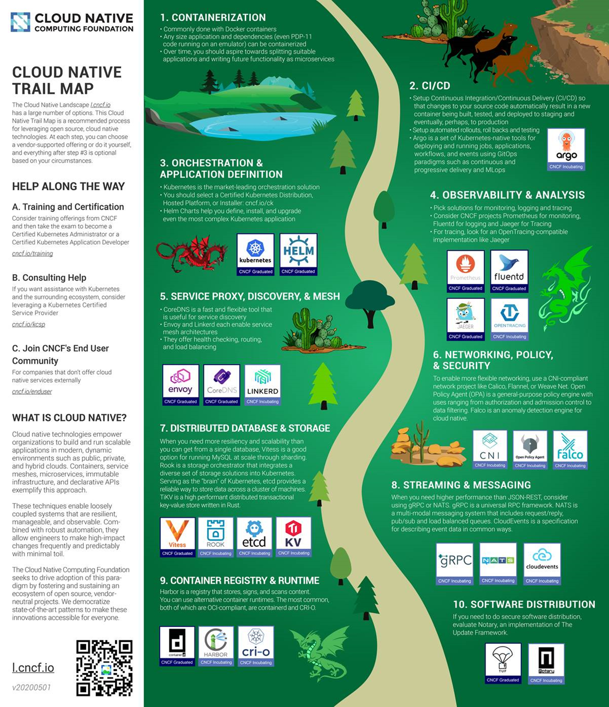

## Cloud Transformation

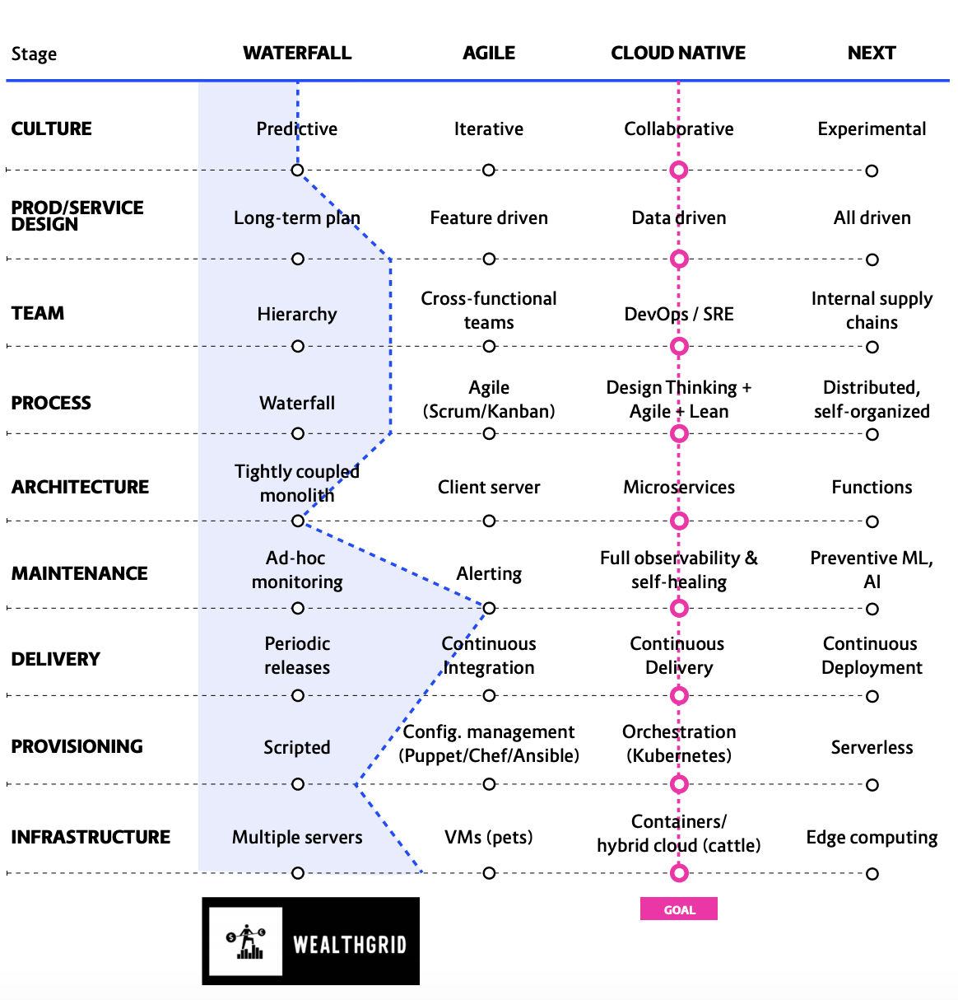

The Tools  landscape : https://landscape.cncf.io/  
https://www.cnpatterns.org/patterns-library  
Talk https://www.youtube.com/watch?v=9nYK8oNtfpg 

## Serverless

 Lightweight, event-based, asynchronous, stateless compute solution that allows you to create small, single-purpose functions that respond to cloud events without the need to manage a server or a runtime environment.  

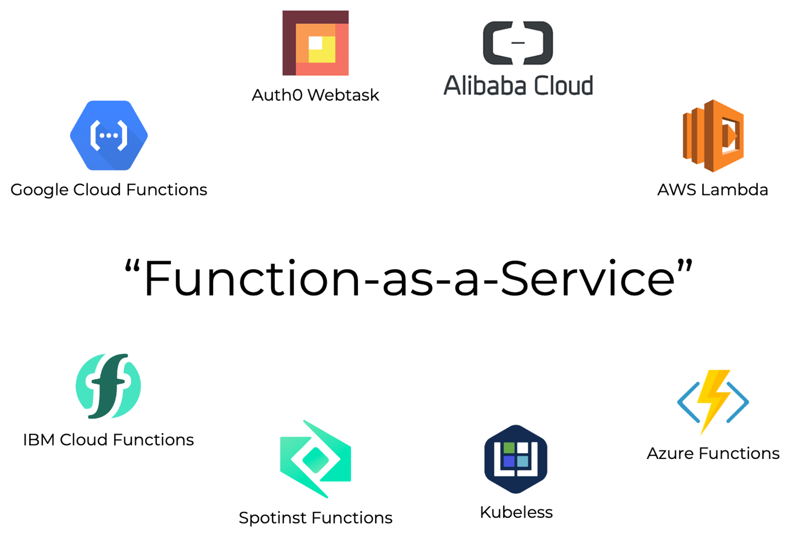

## Approach to MSA

Unix pipe are prime inspiration  
Scale is one unsaid driver for MSA   
- Split vertically based on functionality  
- Focus on functional / usage independence  
- Separate Dev-Repo-Run  
Credits : Md Kamaruzzaman

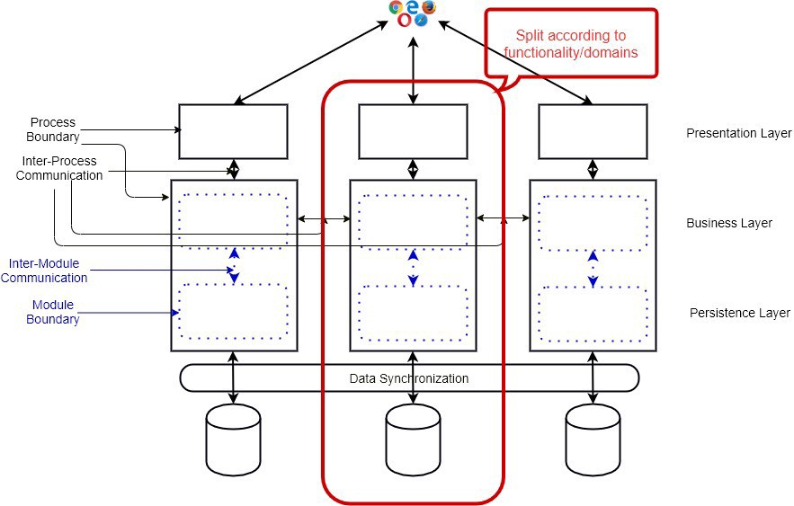

## Microservices Performance 

- One unit presumed to be optimized   
- Longest -shorted-median path to fulfill functionality (call stack)  
- Geo Distributed service calls   
- Mixture of real time with async   
- Factor in retries/timeouts , failover , pooling/service brokers ,Auth  
- Sidecar,specialized fileformat ( optimization is evolving space)  
- Throttling , limiting ~new scenarios   
Tips : https://cloud.google.com/appengine/docs/standard/java/microservice-performance  
https://dzone.com/articles/performance-tuning-in-microservices   
https://www.jrebel.com/blog/performance-problems-with-microservices 

## Catelogue

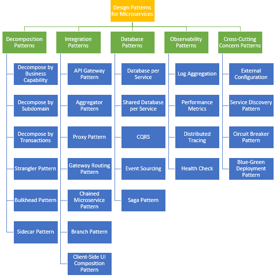

- Diff lists exist   
Credits : Madhuka Udhantha /Dzone 

## Database per Microservice

- Separate Logical DB   
- Can be diff types of DB  
- Complex transactions ??  
  
Credits : Md Kamaruzzaman

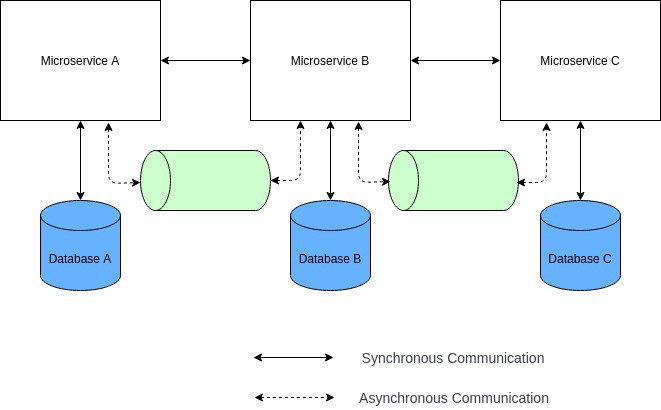

## Event Sourcing 

- Emit events as means of communication   
- Event build up  
- Usually queues  
- Processing guarantees ?   
  
Credits : Md Kamaruzzaman

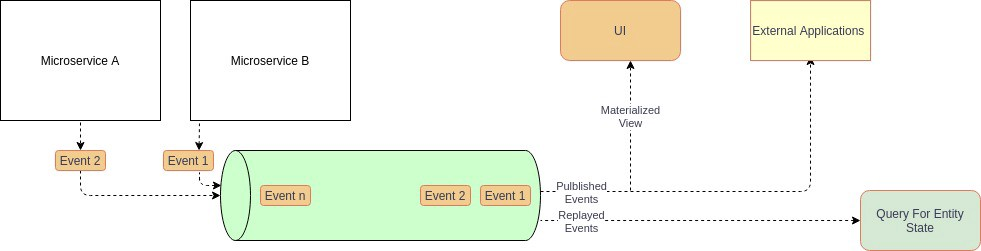

## CQRS

- Read Write separation via Command level aggregation   
- Search can also be considered    
  
Credits : Microsoft 

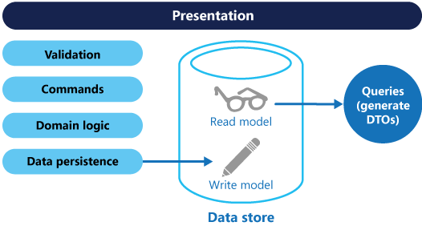

## Saga

- Transactions distributed across services   
- Choreography ,Orchestration  
- Serveless Flavour   
  
Credits : Microsoft 

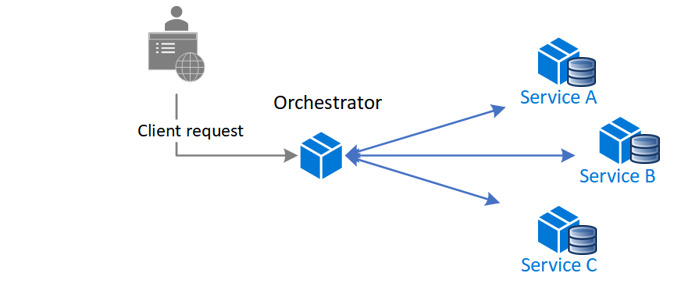

## Backends for Frontends (BFF)

- UI Specific services   
- - I find this junk   
  
  
Credits : Sam Newman  

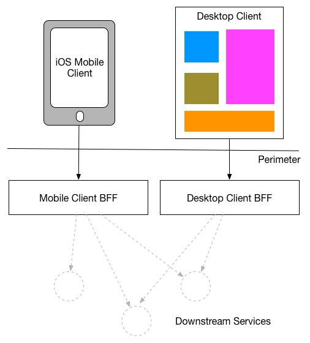

## API Gateway

- Facade -Reverseproxy -Router    
- Cross Cutting concerns   
- Can host intermediate aggregators   
  
Credits : Md Kamaruzzaman

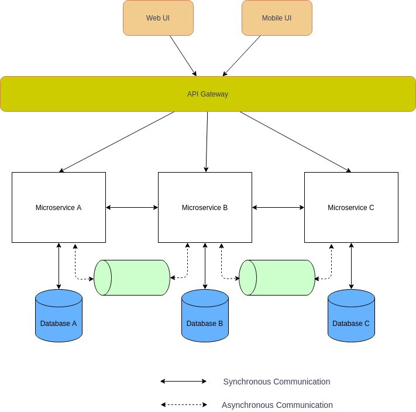

## Strangler 

- Monolith to MSA strategy   
- Step by Step migration   
- Gateway and state issues   
  
Credits : Microsoft 

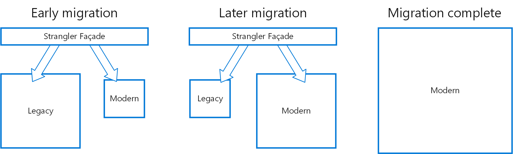

## Circuit Breaker

- Services call Cascade   
- Breaker in case of failure    
- Need better Exceptions and logging   
- Check Hystrix    
  
Credits : Microsoft /Md Kamaruzzaman

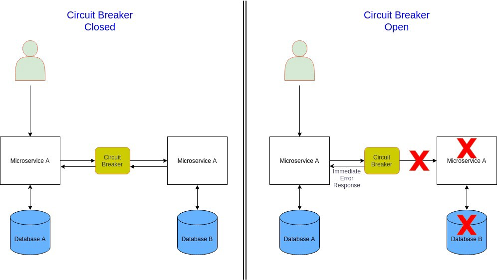

## Externalized Configuration

- Imperative from cloud / pod era   
  
Credits : Microsoft  

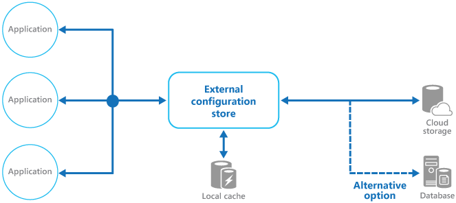

## Consumer-Driven Contract Testing

- API consumers write the tests   
  
Credits : Martin Fowler 

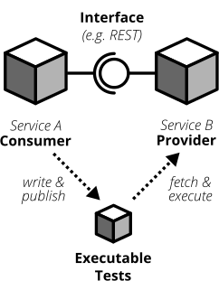

## Sidecar

- Consequence of k8s like deployments  
- Co locate    
  
Credits : Microsoft 

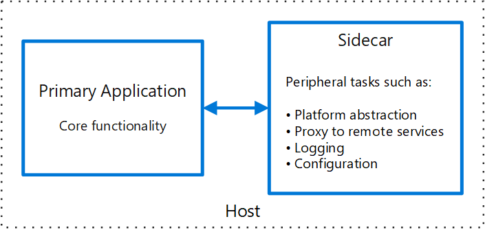

## Bulkhead 

- Resource-service partitioning   
- Think resource exhaustion and quota  
- Check polly     
  
Credits : Microsoft  

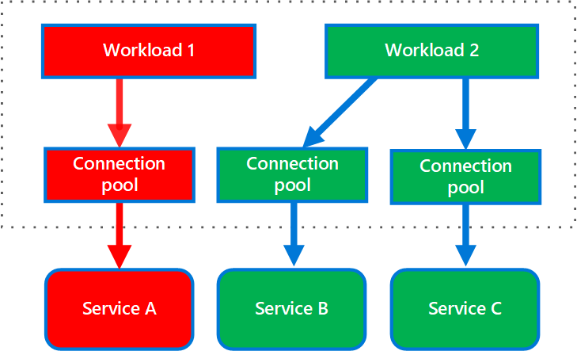

## Anti-Corruption Layer 

- Isolate different subsystems   
- New meets legacy (semantics)  
- Has ESB feel !     
  
Credits : Microsoft  

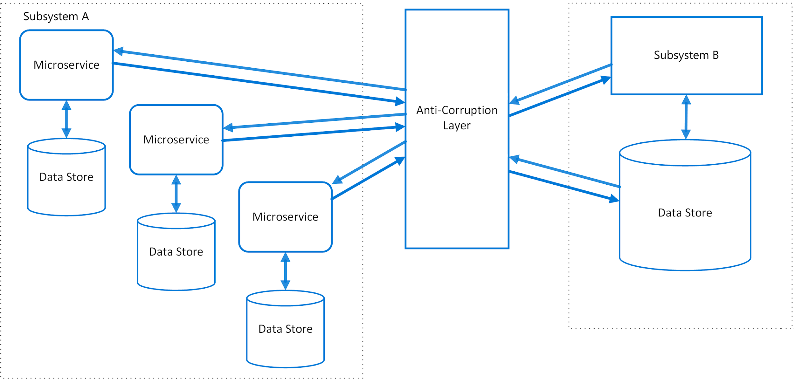

## Service Registry

- Central agent for instances   
- Look up to registry before invocation  
- Check Consul,Eureka     
  
Credits : sebastian peyrott/Auth0

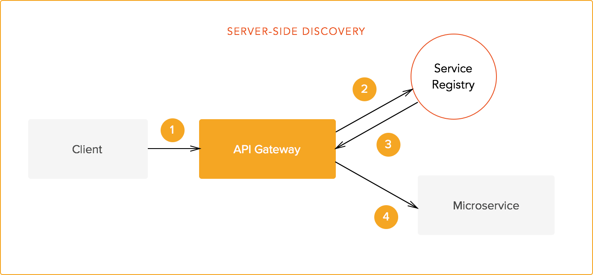

## References 

https://www.win.tue.nl/~wstomv/edu/2ip30/references/criteria_for_modularization.pdf   
https://docs.microsoft.com/en-us/azure/architecture/patterns/index-patterns   
https://www.cs.utexas.edu/users/EWD/transcriptions/EWD04xx/EWD447.html   
https://en.wikipedia.org/wiki/Service-oriented_architecture   
https://towardsdatascience.com/microservice-architecture-and-its-10-most-important-design-patterns-824952d7fa41   
https://martinfowler.com/eaaDev/EventSourcing.html 

## Here are the microservices adoption antipatterns:  
Microservices are a magic pixie dust - believing that a sprinkle of microservices will solve all of your development problems  
Microservices as the goal - making the adoption of microservices the goal and measuring success in terms of the number of services written  
Scattershot adoption - multiple application development teams attempt to adopt the microservice architecture without any coordination  
Trying to fly before you can walk - attempting to adopt the microservice architecture (an advanced technique) without (or not committing to) practicing basic software development techniques, such as clean code, good design, and automated testing  
Focussing on Technology - focussing on technology aspects of microservices, most commonly the deployment infrastructure, and neglecting key issues, such as service decomposition  
More the merrier - intentionally creating a very fine-grained microservice architecture  
Red Flag Law - retaining the same development process and organization structure that were used when developing monolithic applications.  
  

