# Microservices

*By Sachin Dixit*

## Overview

- Services
- Web Services
- Interface
- API
- Conway's Law
- SOA
- Services bus (ESB)
- Events hub
- EIP (list them)
- What is the definition of the above? And what is the difference?

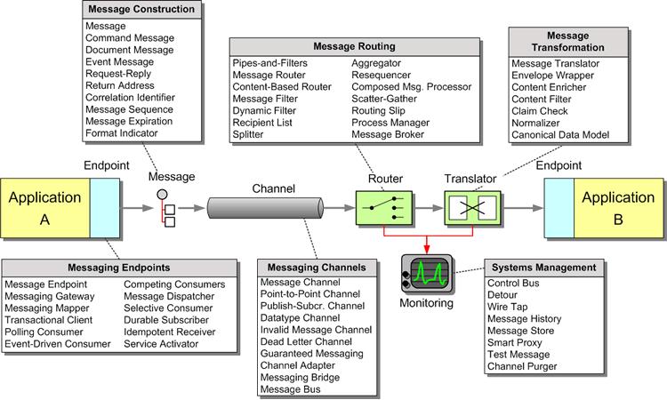

## 2-Tier Architecture

- **Client Tier**
  - The user interface and application programs are run on the client side
- **Data Tier**
  - Database server
- **Advantages**
  - Fast and easy to implement
  - Communication faster
  - Suitable where business rules/logic/operations are static
- **Disadvantages**
  - Performance degrades with scale
  - Data integrity issues due to race conditions

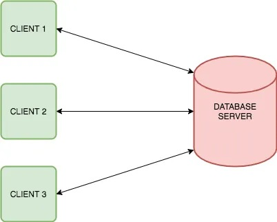

## 3-Tier Architecture

- **Presentation tier**
  - Represents the clients.
  - HTML, CSS, JavaScript (React/Angular/Vue)
- **Business/Application tier**
  - Acts as an intermediary for partially processed data, holds application logic.
  - Spring, .Net, JavaScript with NodeJs
- **Data tier**
  - Database server.
  - MySQL, MongoDB, SQLite, PostgreSQL

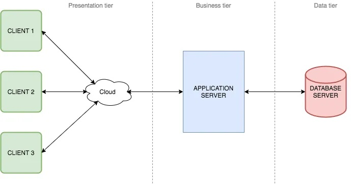

## 3-Tier Architecture Continued..

- **Advantages**
  - Scalability - each tier can scale horizontally
  - High degree of flexibility in deployment
  - Better performance - caching at presentation tier
  - Improved data integrity
  - Improved security
  - Make use of distributed computing
- **Disadvantages**
  - Increased complexity of implementation
  - Increased teams and efforts
  - Complicated observability

## 3-Tier Architectures: Monolith vs Microservices

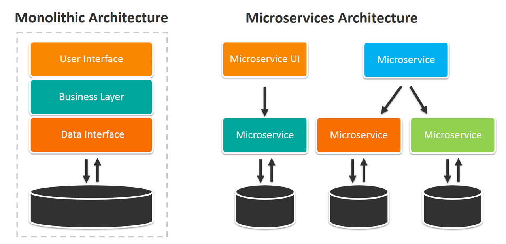

## Today's Web Architecture

Cross-cutting goals:

- Scale
- Uptime
- Cost Efficiency
- Faster Response
- Ease of Integration
- Consistency
- Observability
- Security
- Extensible

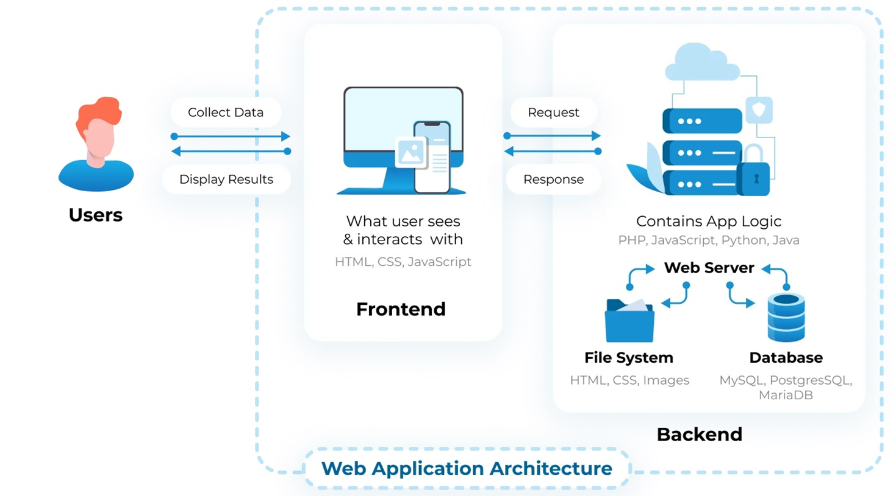

## Web Application Architecture Components

Models of Web Application:

- One Web Server, One Database
- Multiple Web Server, One Database
- Multiple Web Server, Multiple Database

Frontend:

- Single Page Applications (SPA)
- Server Side Rendered Applications (SSR)

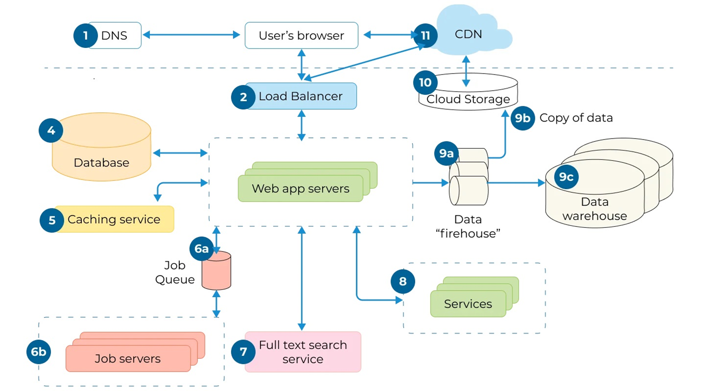

## N-Tier Era

- Logical Layers
- Physical Tiers
- Clustered Scalability
- VM compatible
- Mostly fast but entangled
- PM syndrome!

Credit: https://docs.microsoft.com/en-us/azure/architecture/guide/architecture-styles/n-tier

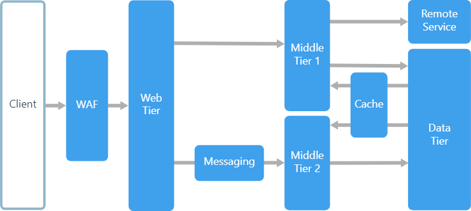

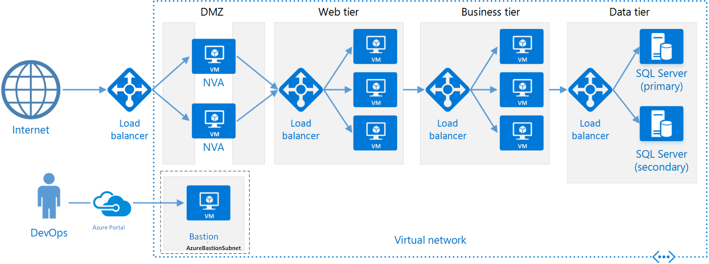

## Monolith

- Single unit deployment, scale by clustering (NDs of WAS)
- Might have a single code base
- All calls native!
- Code might be entangled
- Single DB/Schema, often SPs
- Suspected bad guy of MSA

## Evolution of Dynamic Content Under Web Architecture

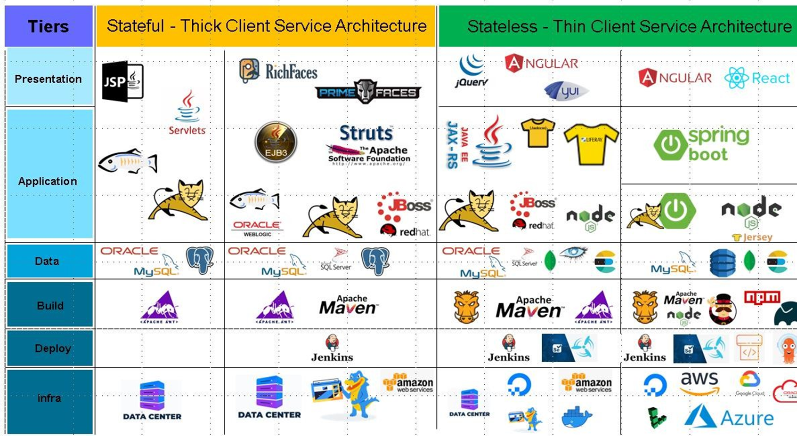

## Good Design: Good Team

- Modularity
- DDD
- High cohesion - loose coupling
- Team insulation
- Co-location

## Evolution of Microservice Architecture

- **Monolith:**
  - Simple, easy to develop but difficult to scale and maintain.
- **SOA:**
  - Partial service separation, but still complex with ESB reliance.
- **Microservices:**
  - Fine-grained, independent services with better scalability, flexibility, and faster deployments.
- **Serverless and Edge Computing:**
  - Further decentralization and simplification, reducing infrastructure concerns and improving responsiveness.
- **Key Influencers:**
  - Agile and DevOps
  - Cloud computing
  - Container and Orchestration (Docker/Kubernetes)

## Other Drivers

- Virtualization (of the hardware stack)
- Containers
- Elastic compute (server disposability)
- Stronger open source
- Developer preferences
- Better networks
- Agile culture
- Innovation speeds!
- NoSQL
- Dependency repos

## Microservices

A microservices architecture consists of a collection of small, autonomous services. Each service is self-contained and should implement a single business capability.

- Small, independent, loosely coupled
- Each service is a separate codebase, managed by a small dev team
- Can be deployed/built/redeployed independently
- Persist their own data or external state
- Communicate with each other by using well-defined APIs
- Don't need to share the same technology stack, libraries, or frameworks

Ref: https://docs.microsoft.com/en-us/azure/architecture/guide/architecture-styles/microservices

## Typical Microservices Deployment

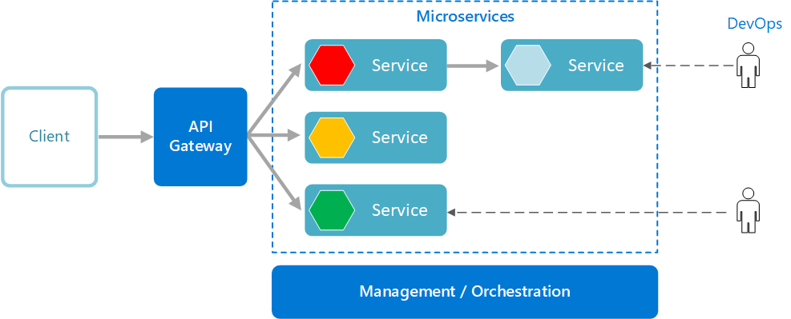

## Microservices Necessitates

- Orchestrator
- Containers are implied but not necessary
- HTTP is implied but no consensus (e.g. gRPC)
- API Gateway
  - Common facade
  - Multiple protocols
  - Facilitates pooling / load balancing
  - Enforce auth
  - Logging
  - Tracing
  - Redirection
- Stateless - not necessary
- CI-CD are also helpful
- Service Mes(s)h :)

## Microservices Costs

- More moving parts = complexity
- Testing evolving dependencies
- Governance burden
- Network trips!
- Distributed tracing
- Dev skills
- Hidden Async and BASE!
- How small is micro enough?

## Key Characteristics of Microservice Architecture

- **Single Responsibility**
  - Each microservice is responsible for one piece of functionality or business capability
- **Decentralized Data Management**
  - Each service typically manages its own database or data storage
- **Autonomy**
  - Microservices are developed, deployed, and scaled independently
- **Inter-Service Communications**
  - Using lightweight protocols like HTTP/REST, gRPC, or messaging systems like Kafka or RabbitMQ
- **Technological Diversity**
  - Each microservice can be developed using different programming languages, databases, or tools based on the service's requirements.

## Microservices Architecture Design Principles

- **Independent and Autonomous/Self-governing services**
  - Each service can be developed, tested, as well as deployed independently without affecting the other parts of the system
- **API aggregation**
  - Microservices should be able to communicate without having a programming language barrier
- **Flexibility**
  - Allow services to become adaptable to future changes
- **Scalability**
  - Enables the application to be modified according to increasing or decreasing traffic, data, and complexity without affecting the performance of the system
- **Constant monitoring**
  - Logging and metrics, health checks, alerting and notifications

## Microservices Architecture Design Principles - Continued

- **Failure Isolation / Failure resilience**
  - Timeouts, circuit breakers, throttling
- **Realtime load balancing**
  - Autoscaling
- **Inclusion of DevOps**
  - Docker, Kubernetes
- **Versioning**
  - Helps to manage changes in the services over time and update them to the latest ones.
- **Availability**

## Multigrained Architecture: Think Big, Start Small, Move Fast

- It is completely acceptable to have an enterprise application that contains microservices, miniservices and even macroservices (monolith components).

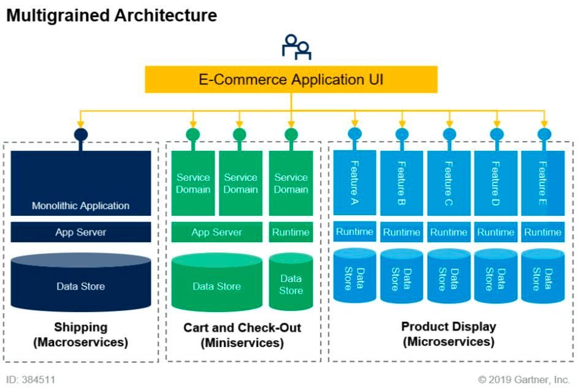

## Cloud Native & 12 Factor & Reactive

- Parallel drivers that implied MSA
- Cloud Native => Loosely defined term for cloud-hosted applications. Might mean containerized, orchestrated, microservices.
- PaaS, IaaS, FaaS Blah Blah
- https://www.cncf.io/

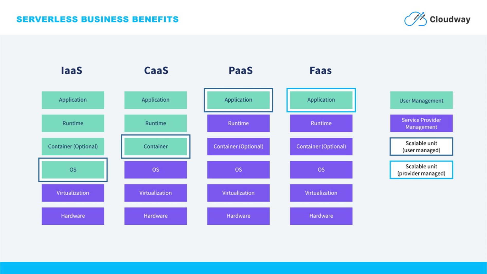

## Reactive Manifesto

- Responsive => rapid, consistent, time bound
- Resilient => replication, containment, isolation and delegation
- Elastic: predictive as well as reactive scaling
- Message Driven: async, loose coupling, location transparency, back pressure, non-blocking

https://www.reactivemanifesto.org/

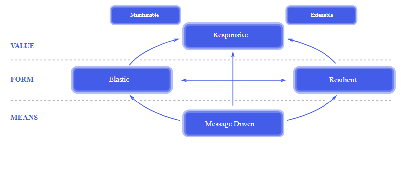

## The Twelve Factors

- **I. Codebase:** One codebase tracked in revision control, many deploys
- **II. Dependencies:** Explicitly declare and isolate dependencies
- **III. Config:** Store config in the environment
- **IV. Backing services:** Treat backing services as attached resources
- **V. Build, release, run:** Strictly separate build and run stages
- **VI. Processes:** Execute the app as one or more stateless processes
- **VII. Port binding:** Export services via port binding
- **VIII. Concurrency:** Scale out via the process model
- **IX. Disposability:** Maximize robustness with fast startup and graceful shutdown
- **X. Dev/prod parity:** Keep development, staging, and production as similar as possible
- **XI. Logs:** Treat logs as event streams
- **XII. Admin processes:** Run admin/management tasks as one-off processes
- **XIII. API First:** Make everything a service
- **XIV. Telemetry:** Visibility
- **XV. Auth:** Identity / RBAC

Refs: https://12factor.net/ and https://github.com/cjudd/15-factor-app-workshop

## Cloud Journey

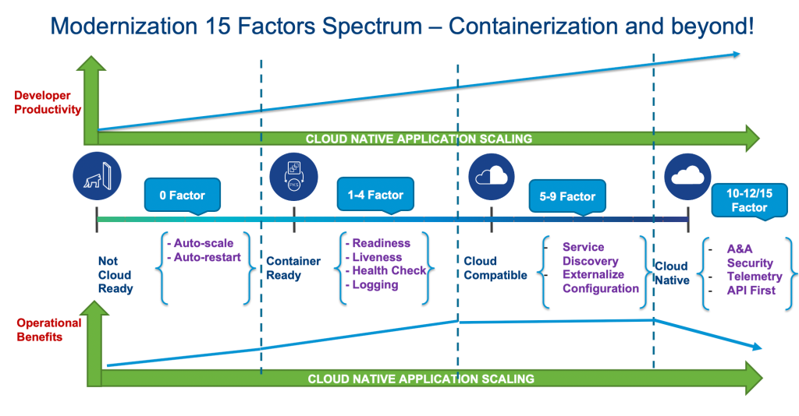

Credit: https://cloudificationzone.com/

## Approaching Cloud Native

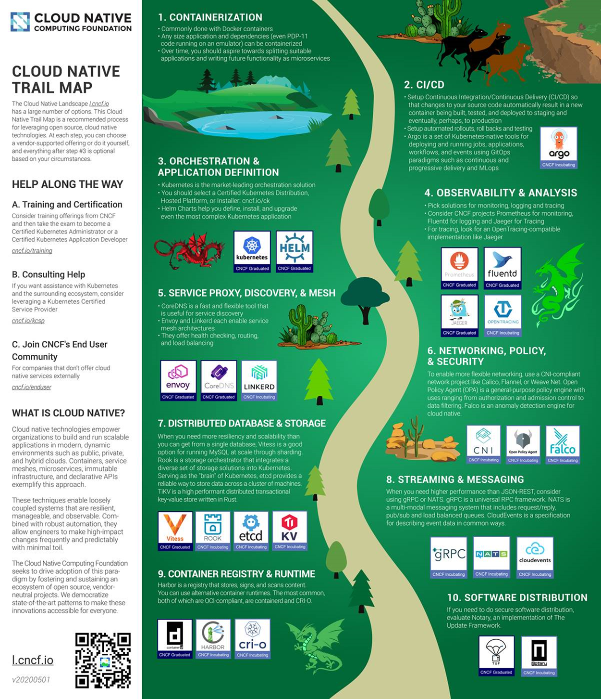

## Cloud Transformation

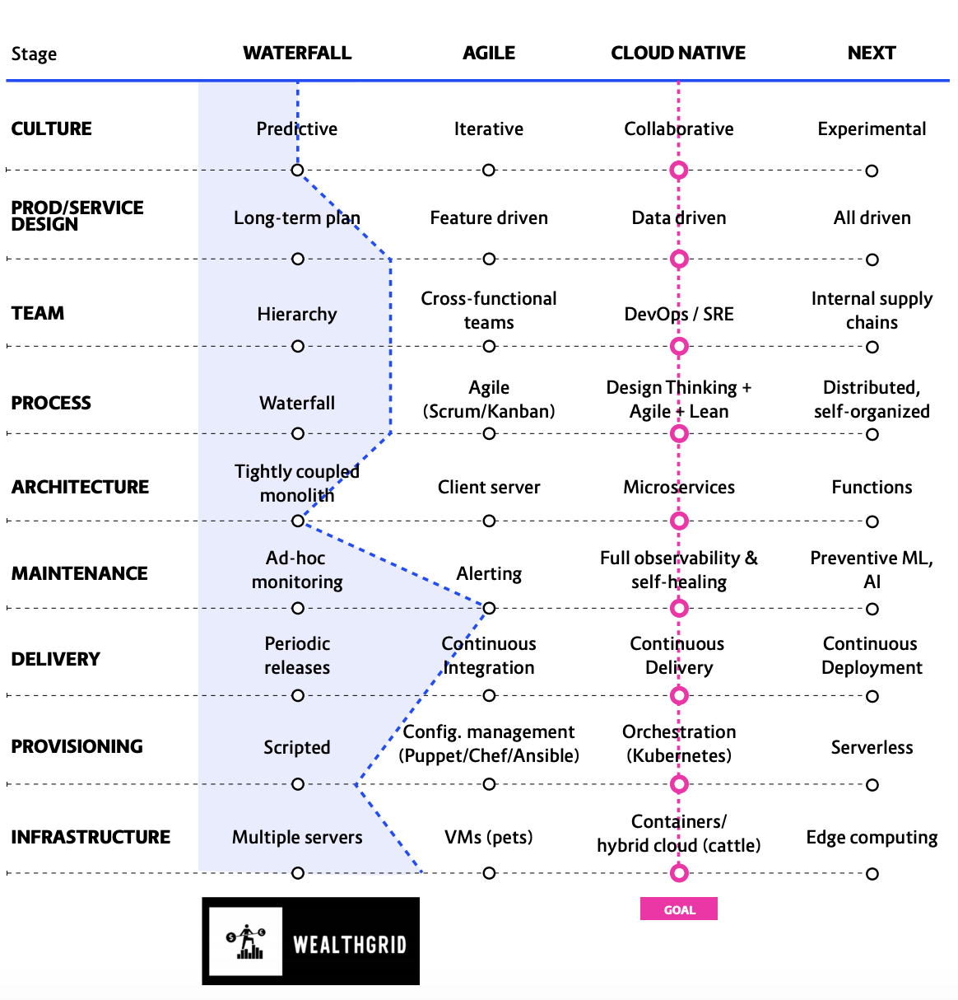

- The tools landscape: https://landscape.cncf.io/
- https://www.cnpatterns.org/patterns-library
- Talk: https://www.youtube.com/watch?v=9nYK8oNtfpg

## Serverless

Lightweight, event-based, asynchronous, stateless compute solution that allows you to create small, single-purpose functions that respond to cloud events without the need to manage a server or a runtime environment.

"Function-as-a-Service"

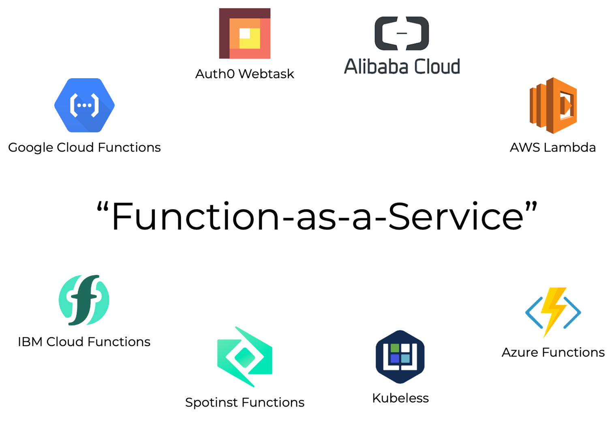

## Approach to MSA

- Unix pipes are prime inspiration
- Scale is one unsaid driver for MSA
- Split vertically based on functionality
- Focus on functional / usage independence
- Separate Dev-Repo-Run

Credits: Md Kamaruzzaman

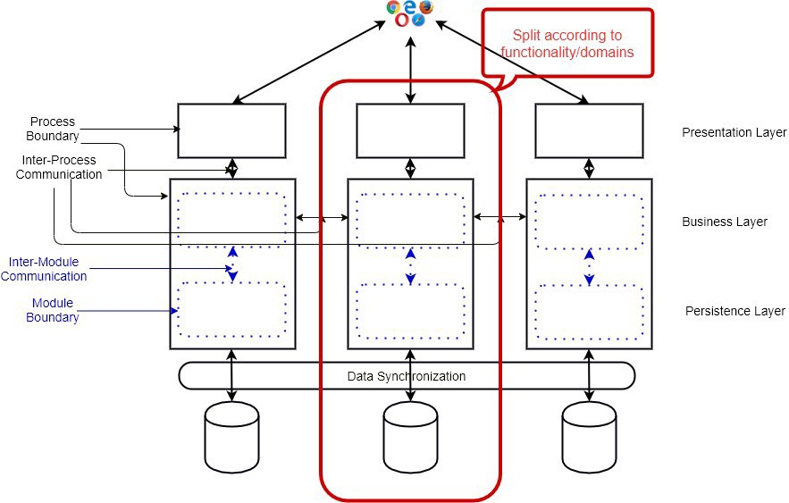

## Microservices Performance

- One unit presumed to be optimized
- Longest-shortest-median path to fulfill functionality (call stack)
- Geo-distributed service calls
- Mixture of real time with async
- Factor in retries/timeouts, failover, pooling/service brokers, auth
- Sidecar, specialized file format (optimization is an evolving space)
- Throttling, limiting ~ new scenarios

Tips:
- https://cloud.google.com/appengine/docs/standard/java/microservice-performance
- https://dzone.com/articles/performance-tuning-in-microservices
- https://www.jrebel.com/blog/performance-problems-with-microservices

## Catalogue

- Diff lists exist

Credits: Madhuka Udhantha / Dzone

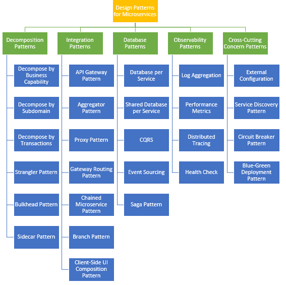

## Database per Microservice

- Separate logical DB
- Can be different types of DB
- Complex transactions??

Credits: Md Kamaruzzaman

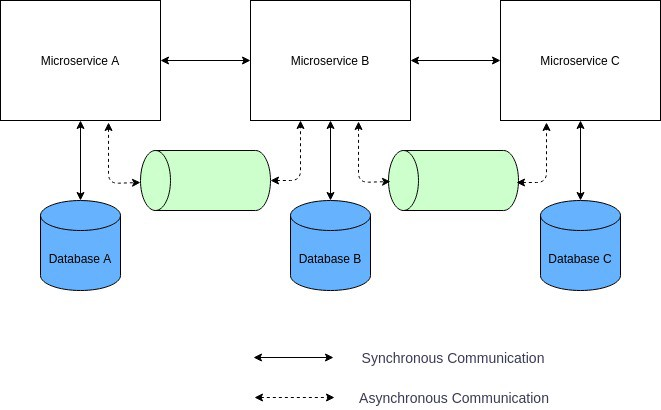

## Event Sourcing

- Emit events as means of communication
- Event build up
- Usually queues
- Processing guarantees?

Credits: Md Kamaruzzaman

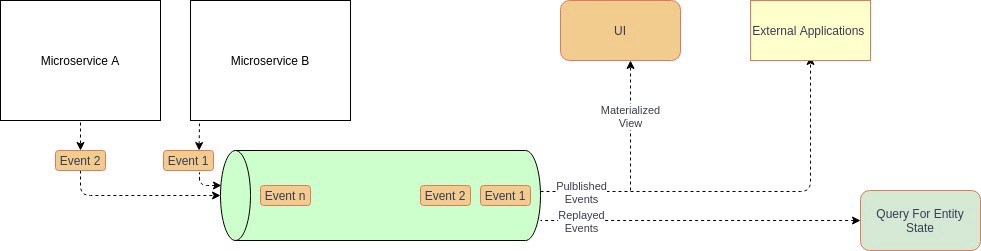

## CQRS

- Read/Write separation via command-level aggregation
- Search can also be considered

Credits: Microsoft

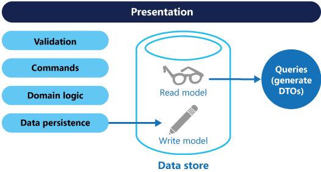

## Saga

- Transactions distributed across services
- Choreography, Orchestration
- Serverless flavour

Credits: Microsoft

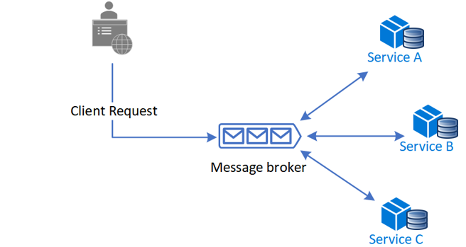

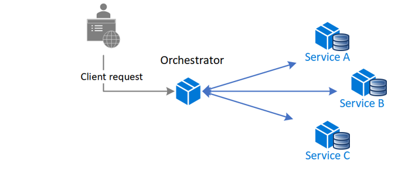

## Backends for Frontends (BFF)

- UI-specific services
- I find this junk

Credits: Sam Newman

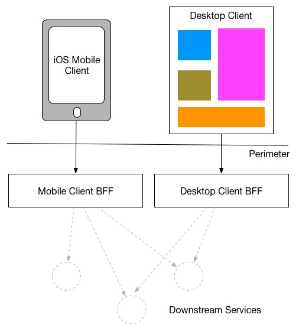

## API Gateway

- Facade - reverse proxy - router
- Cross-cutting concerns
- Can host intermediate aggregators

Credits: Md Kamaruzzaman

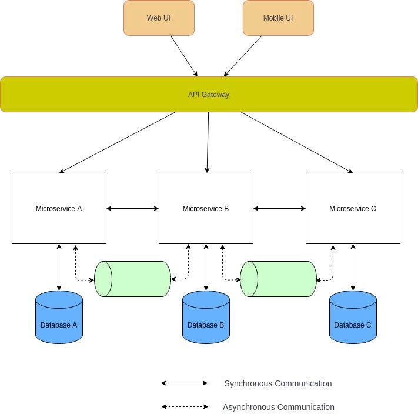

## Strangler

- Monolith to MSA strategy
- Step-by-step migration
- Gateway and state issues

Credits: Microsoft

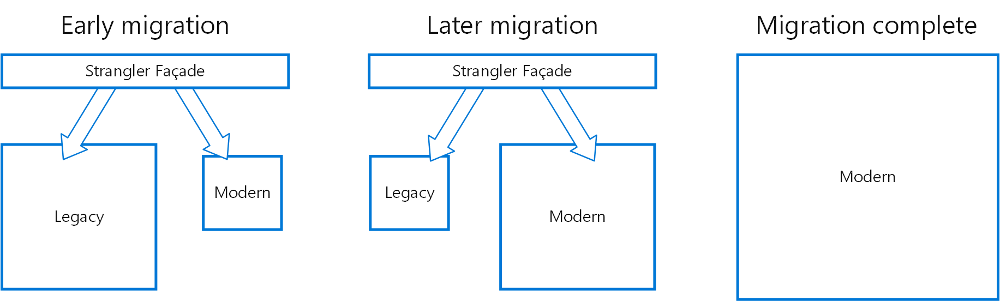

## Circuit Breaker

- Services call cascade
- Breaker in case of failure
- Need better exceptions and logging
- Check Hystrix

Credits: Microsoft / Md Kamaruzzaman

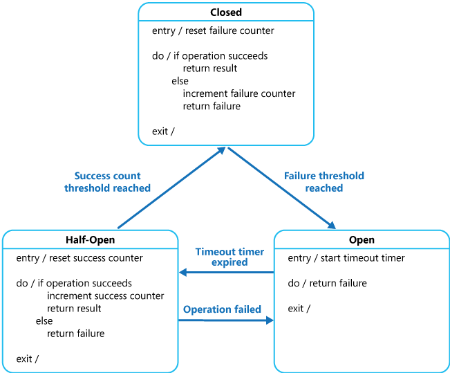

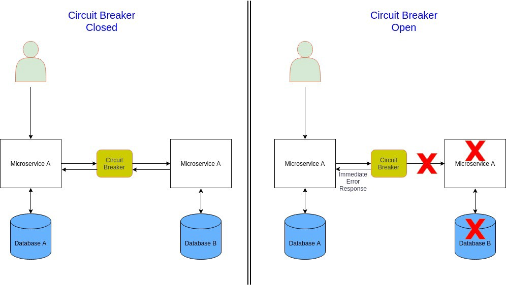

## Externalized Configuration

- Imperative from the cloud / pod era

Credits: Microsoft

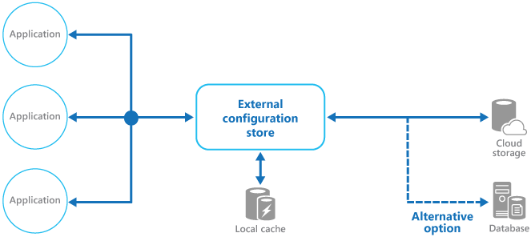

## Consumer-Driven Contract Testing

- API consumers write the tests

Credits: Martin Fowler

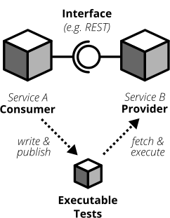

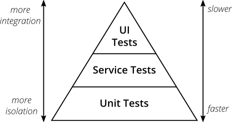

## Sidecar

- Consequence of k8s-like deployments
- Co-locate

Credits: Microsoft

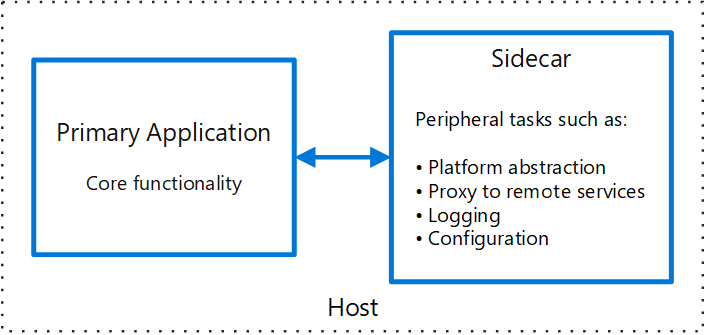

## Bulkhead

- Resource-service partitioning
- Think resource exhaustion and quota
- Check Polly

Credits: Microsoft

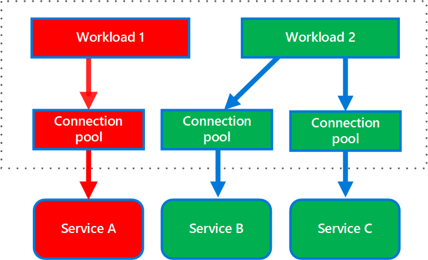

## Anti-Corruption Layer

- Isolate different subsystems
- New meets legacy (semantics)
- Has ESB feel!

Credits: Microsoft

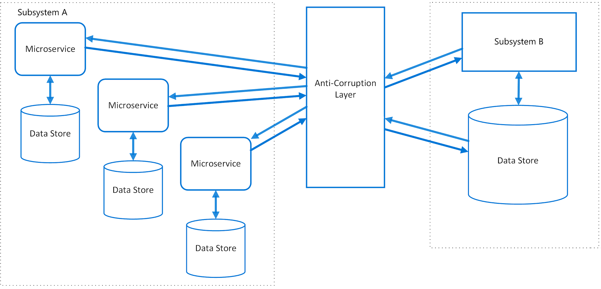

## Service Registry

- Central agent for instances
- Look up to registry before invocation
- Check Consul, Eureka

Credits: Sebastian Peyrott / Auth0

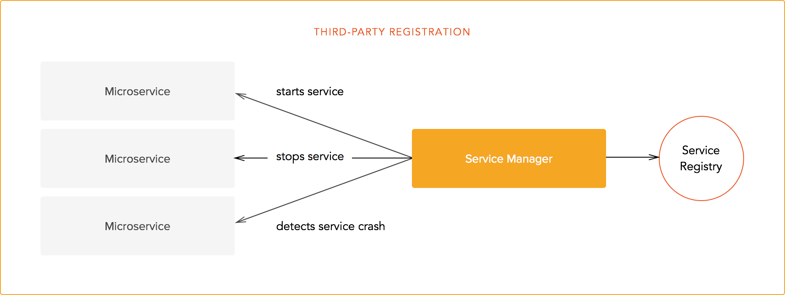

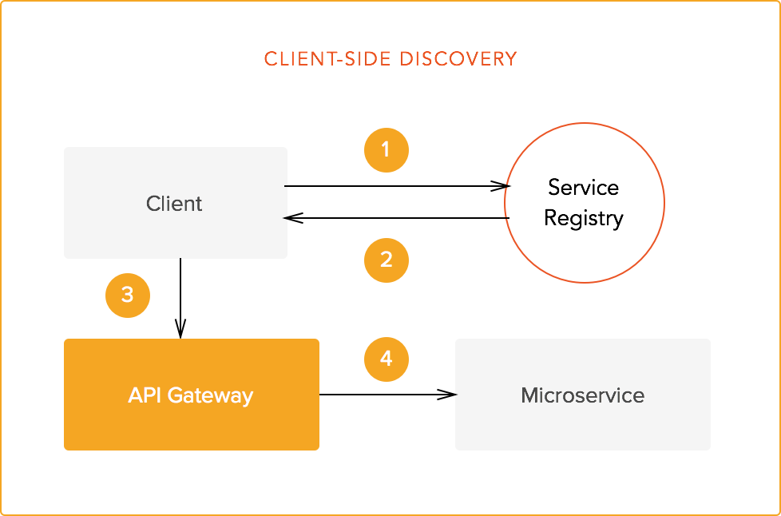

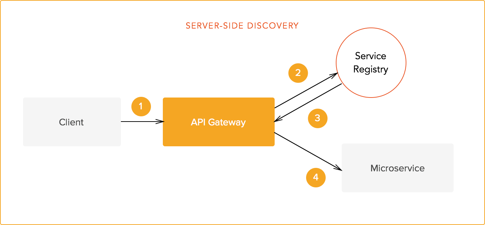

## References

- https://www.win.tue.nl/~wstomv/edu/2ip30/references/criteria_for_modularization.pdf
- https://docs.microsoft.com/en-us/azure/architecture/patterns/index-patterns
- https://www.cs.utexas.edu/users/EWD/transcriptions/EWD04xx/EWD447.html
- https://en.wikipedia.org/wiki/Service-oriented_architecture
- https://towardsdatascience.com/microservice-architecture-and-its-10-most-important-design-patterns-824952d7fa41
- https://martinfowler.com/eaaDev/EventSourcing.html

## Microservices Adoption Antipatterns

- **Microservices are a magic pixie dust** - believing that a sprinkle of microservices will solve all of your development problems
- **Microservices as the goal** - making the adoption of microservices the goal and measuring success in terms of the number of services written
- **Scattershot adoption** - multiple application development teams attempt to adopt the microservice architecture without any coordination
- **Trying to fly before you can walk** - attempting to adopt the microservice architecture (an advanced technique) without (or not committing to) practicing basic software development techniques, such as clean code, good design, and automated testing
- **Focussing on Technology** - focussing on technology aspects of microservices, most commonly the deployment infrastructure, and neglecting key issues, such as service decomposition
- **More the merrier** - intentionally creating a very fine-grained microservice architecture
- **Red Flag Law** - retaining the same development process and organization structure that were used when developing monolithic applications.
